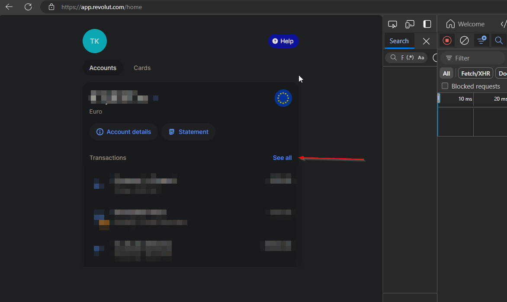
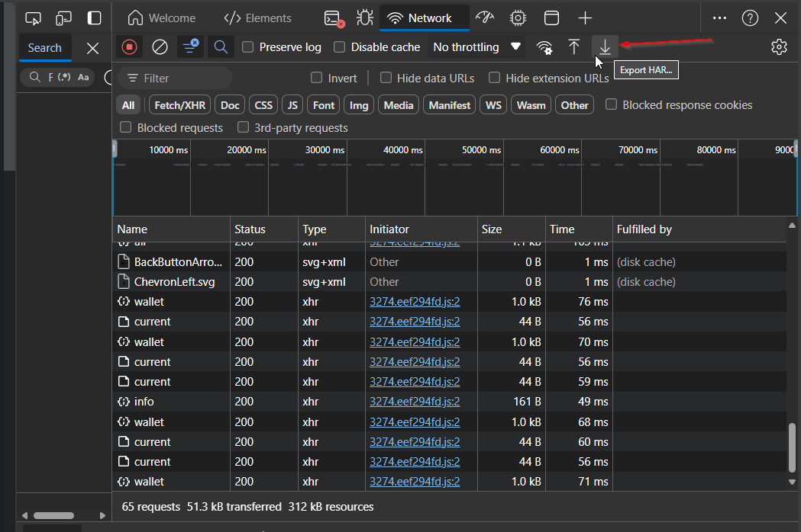

### RevolVer

Revolut doesn't provide an option to export transactions with custom categories directly. This script replicates the HTTP requests made by the Revolut web application to retrieve transaction data, and export it to SQLite and/or Excel file.

### Installation

1. Clone this project  
2. Install required packages  
`pip install -r .\requirements.txt`

### Requirements
Before each usage, a HAR file must be exported from Revolut web application and saved to `consume/` directory. The script will extract authentication data and later use it to fetch transactions.

1. Go to https://app.revolut.com and login.
2. Open developer tools by pressing F12.   
3. Click on "See all" transactions:  


4. In developer tools, go to Network tab and export HAR:  


5. Save the file "app.revolut.com.har" to `consume/` directory. Do not change the filename.  
6. Proceed by running the script right away as the authentication data tend to expire fast.  

### Usage

At minimum, only `--date` must be provided to fetch results for single month and save them to both SQLite and Excel file:  
`python revol_ver.py -d 2024.4`  

For initial export, you may want to export all records. Set `--period` to `all`. Also make sure to edit setting `AllImportLookBackYears` in config.ini to desired export period.  
`python revol_ver.py -p all`  

By default, it will save the transactions to SQLite database with filename `trans_db.sql` and Excel file to `exports/` directory. Change this by setting `--output` to either `db` or `excel`.  
`python revol_ver.py -p all -o excel` 

Once database is created, it will also be used for deduplication. It can be turned off with `-dd` flag, but only when output is set to `excel`.

Other command line arguments are mostly used for testing purposes. Use `--help` see all options:  

    python revol_ver.py -h
    usage: revol_ver.py [-h] [-p {month,all}] [-s {web_request,file}] [-d DATE] [-o {db,excel,all}] [-dd]

    Saves transactions from Revolut to database or Excel

    options:
      -h, --help            show this help message and exit
      -p {month,all}, --period {month,all}
      -s {web_request,file}, --source {web_request,file}
      -d DATE, --date DATE  Month and year (YYYY.MM), required for period "month"
      -o {db,excel,all}, --output {db,excel,all}
                            Output destinations
      -dd, --dont_deduplicate
                            Don't use database for deduplication


### Common errors

1. **HAR file not found**  
`FileNotFoundError: [Errno 2] No such file or directory: 'consume\\app.revolut.com.har'`

    Reason and fix: Means you forgot to export HAR file to `consume/` directory or filename is not `app.revolut.com.har`
  
2. **Token expired**  

    ```
    Exception: Fetching failed, got response  
    {'message': 'Access token expired', 'code': 9039}  
    ```

    Reason and fix: Authentication data in `app.revolut.com.har` is expired. Export HAR and try again.  

3. **Custom category not defined**
   ```
   Exception:
   Category with ID aead2528-4b7b-481d-bc1f-0f27ec4b3926 was not found. Full transaction:
   ValidationInfo(config={'title': 'TransactionModel'}, context=None, data={'id': '66xxxxab-0e30-axxe-8cc6-791xxxxxxx4b', 'legId': '66xxxxab-0e30-axxe-0000-791xxxxxxx4b', 'type': 'CARD_PAYMENT', 'state': 'COMPLETED', 'startedDate': datetime.datetime(2024, 8, 2, 15, 44, 10), 'updatedDate': datetime.datetime(2024, 8, 3, 13, 13, 38, 150000), 'completedDate': datetime.datetime(2024, 8, 3, 13, 13, 38, 149000), 'createdDate': datetime.datetime(2024, 8, 2, 15, 44, 11, 198000), 'currency': 'EUR', 'amount': -1213.0, 'fee': 0.0, 'balance': 9999.0, 'description': 'Merkur Lj. Vizmarje', 'tag': 'shopping'}, field_name='category')
   ```

    Reason and fix: The script refuses to proceed if Revolut transaction with custom category is not defined in `config.ini`. To fix this specific example, an entry with UUID and custom category name must be added to `custom.categories` section of file `config.ini`:

    ```
    [custom.categories]
    aead2528-4b7b-481d-bc1f-0f27ec4b3926 = home_improvements   
    ```

    With custom categories configured, the script will use this mapping to transform the UUID returned by Revolut to defined category name which is visible in column `category` in both database table and Excel.